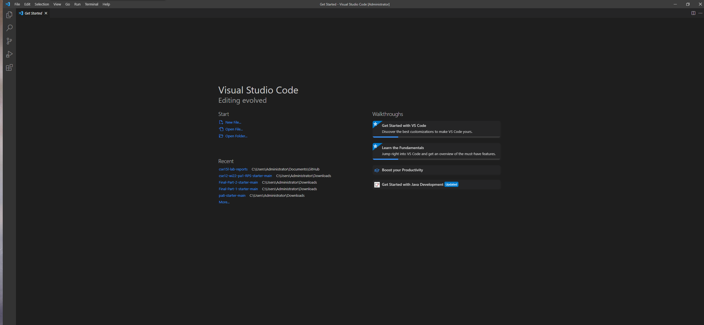
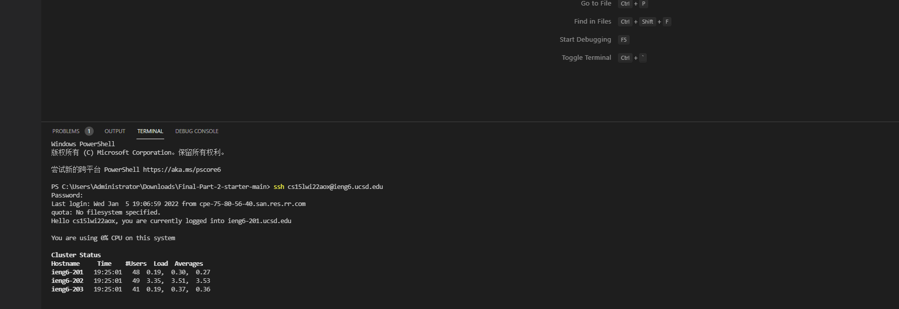
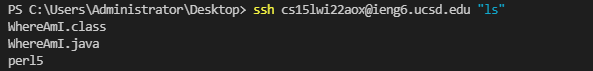
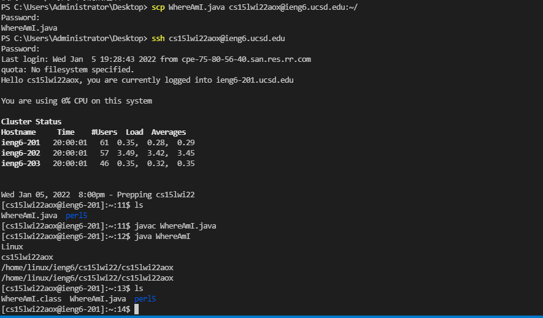
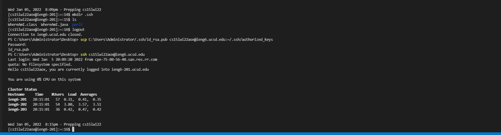
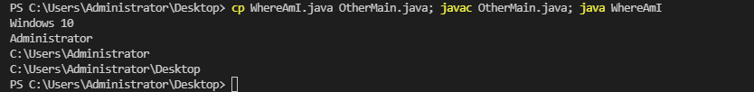

# How to Log into Course-Specific Account on ieng6

1. Installing VSCode
* Download VSCode from official Website. [Link to Website](https://code.visualstudio.com/).
* Install it. 

2. Remotely Connecting
* Open terminal
* Type in "ssh cs15lwi22zz@ieng6.ucsd.edu" (Replace zz with personal code)
* Type in password. 

3. Trying Some Commands
* Type commands after connecting to server. 
* List of Commands: 
    * Cd - change directory
    * Ls - list 
    * Ls -a  - list all hidden
    * Ls -lat  - full list
    * Pwd - print working directory

4. Moving Files with scp 
* Open terminal at local
* Use command line "scp WhereAmI.java cs15lwi22zz@ieng6.ucsd.edu:~/"

5. Setting an SSH Key
* Use command "ssh-keygen"
* Use "scp id_rsa.pub cs15lwi22@ieng6.ucsd.edu:~/.ssh/authorized_key" to copy the file to Server
* now password is no longer needed when sch or scp

6. Optimizing Remote Running
* Write a command in quotes at the end of an ssh command to directly run it. 
* Use semicolons to run multiple commands on the same line.
* Use up arrow to retrieve previous commands.    

