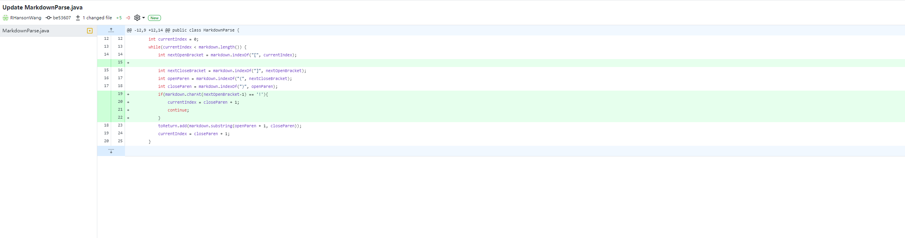
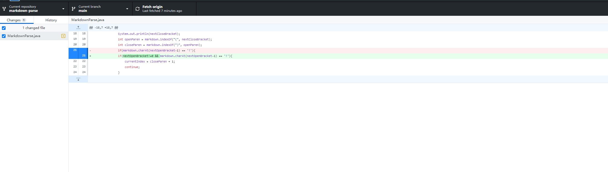
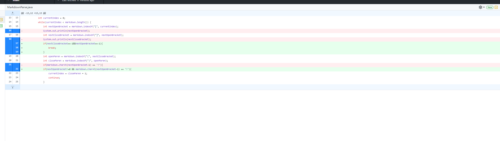

# 3 changes made to code when encountered edge case error

## 1. Edge case: Link to Image would also be searched and printed out

[link to test file that induced the error](C:\Users\Administrator\Documents\GitHub\cse15l-lab-reports\test-file2.md)
After tests, I found that the code originally written wouldn't work for MD files countaining link to image as the link to image has a '!'. To solve this problem, an if statement checking for char '!' is added. If found, the current index will +1. 

## 2. Edge case: Link to the very first link will output an error if nothing is in front

[link to test file that induced the error](C:\Users\Administrator\Documents\GitHub\cse15l-lab-reports\test-file3.md)After further tests, I found that the very first link will output an error `IndexOutOfBound`. The error comes from the if statement added. The index for `nextOpenBracket` is 0, making `nextOpenBracket`-1 = -1, causeing the exception to happen. This is fixed by adding another check in the if statement making sure that `nextOpenBracket` isn't 0.

## 3. Edge case: Exception when no link is present in the tester Markdown file

[link to test file that induced the error](C:\Users\Administrator\Documents\GitHub\cse15l-lab-reports\test-file4.md)
When testing edge case when there is no links present in file. It runs in to another `IndexOutOfBound` exception. This is because while searching for `nextOpenBracket` in the if statement, it becomes -1 causing the index to go over bound. This is fixed by breaking the loop when `nextOpenBracket` and `nextCloseBracket` are -1. 