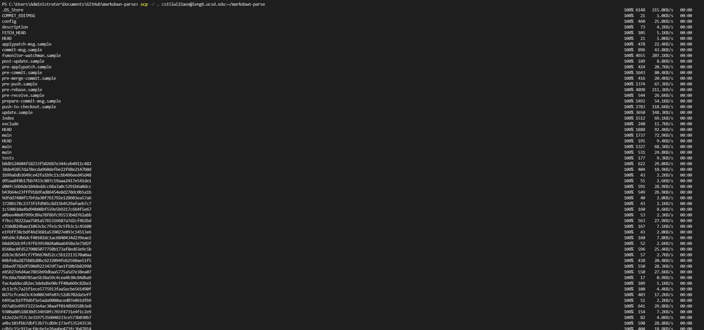
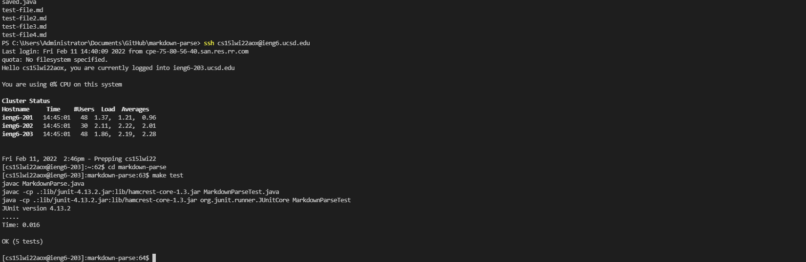
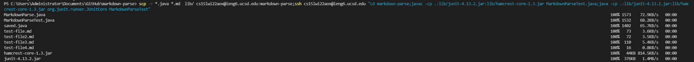
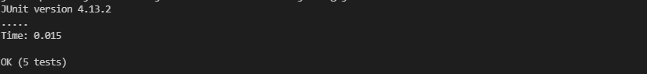

# Copy whole directories with scp -r
## 1. Copying  whole markdown-parse directory to ieng6 account

By using `scp -r`, the whole markdown parse directory is copied to ieng6 server. 
## 2. Logging into account after doing `scp -r` and compiling and running the tests

`ssh` to log into account, `cd` to the directpry desired, and use the created make file to run the tests. 
## 3. Running commands in one line

`ssp` `ssh` and run tests in one line argument 
