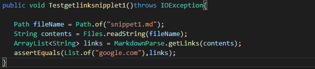
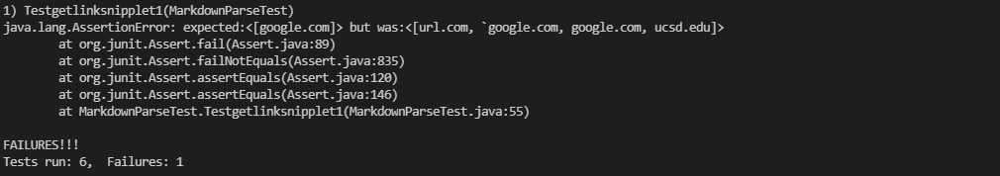
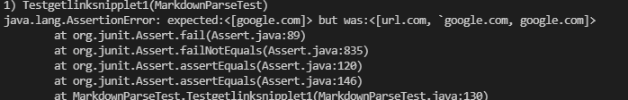
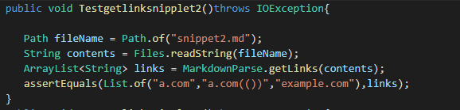
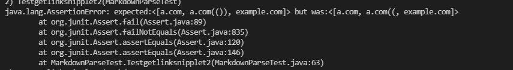
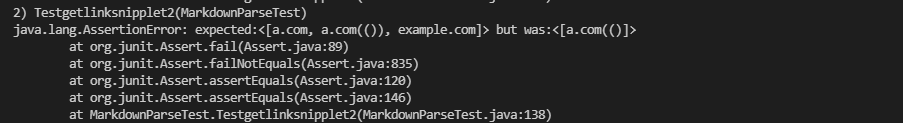
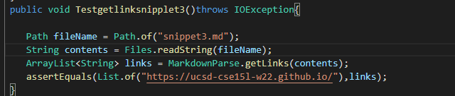
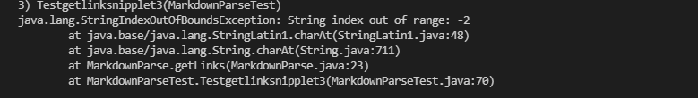
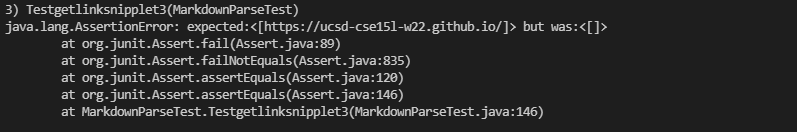

# Adding tests for MarkdownParse.java
## 1. Snipplet 1\
\

## 2. Snipplet 2\
\

## 3. Snipplet 3\
\

For the screenshots, the first shown is my implementation, the second is from the code shared with me by Aldrin Cheung. 
## 4. Answers to question:
Do you think there is a small (<10 lines) code change that will make your program work for snippet 1 and all related cases that use inline code with backticks? If yes, describe the code change. If not, describe why it would be a more involved change.\
Ans: Yes. The code should be able to fix the problem within 10 lines. By adding a check before any index is taken in, check that there isn't any backticks in between"[]", the code will exclude the links that are not correctly inputted. \
Do you think there is a small (<10 lines) code change that will make your program work for snippet 2 and all related cases that nest parentheses, brackets, and escaped brackets? If yes, describe the code change. If not, describe why it would be a more involved change.\
Ans: Yes. I think the whole problem takes less than 10 lines to fix. It is easy to fix the nestes parentheses by basically adding an additional check on parenthesis, and take the last parenthesis before next bracket as the close index. The problem with nested brackets can be fixed by also taking the last closing bracket before parenthesis. \
Do you think there is a small (<10 lines) code change that will make your program work for snippet 3 and all related cases that have newlines in brackets and parentheses? If yes, describe the code change. If not, describe why it would be a more involved change.\
Ans: No. When considering the lines in between brackets and parenthesis. The problem will be hard to solve within 10 lines. As the current getLink methods relies on indexing the brackets and parenthesis. Line change within the parenthesis is harder to index and detection for empty lines also requires more lines to resolve the problem.\